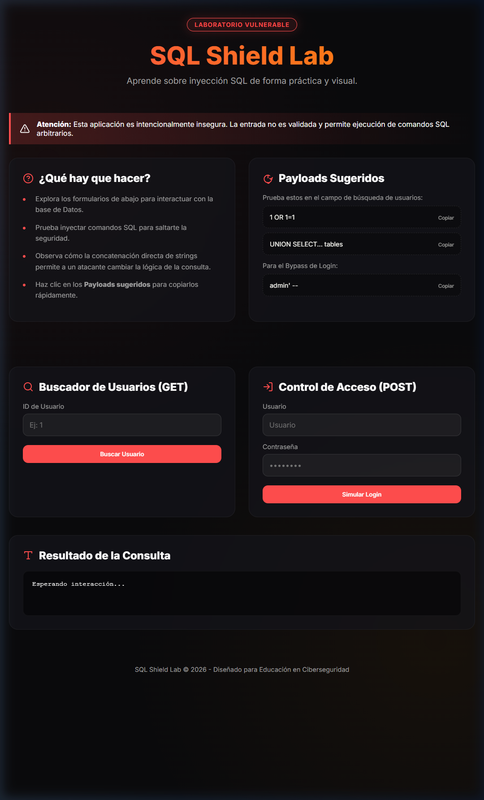

# SQL Shield Lab - Asignación #3
### Universidad Cenfotec
**Curso:** Seguridad en Bases de Datos  
**Estudiante:** RICARDO JOSE CHINCHILLA GONZALEZ  

---

Este repositorio contiene un laboratorio interactivo para el estudio de vulnerabilidades de **Inyección SQL (SQLi)** y sus métodos de mitigación. El proyecto presenta dos versiones de una aplicación web con una interfaz premium diseñada para facilitar el aprendizaje práctico.



## Estructura del Proyecto

- `vulnerable-app/`: Versión intencionalmente vulnerable a SQL Injection. Utiliza concatenación directa de strings en consultas SQL.
- `secure-app/`: Versión protegida mediante **Consultas Parametrizadas (Prepared Statements)** y validación de entradas.

## Características de la Nueva Interfaz Premium

- **Dashboard Moderno**: Diseño "Dark Mode" con efectos de glassmorphism y tipografía Inter.
- **Laboratorio Interactivo**: Guías integradas paso a paso sobre qué buscar y cómo explotar las vulnerabilidades.
- **Payloads Sugeridos**: Botones de copia rápida para los ataques de inyección más comunes.
- **Visualizador de Consultas**: Consola de resultados estilo terminal para analizar la información extraída de la base de datos.

## Requisitos
- Docker y Docker Compose

## Ejecución

### 1. Versión Vulnerable (Puerto 5000)
Para iniciar el entorno vulnerable:
```bash
cd vulnerable-app
docker compose up --build -d
```
Accede a: [http://localhost:5000](http://localhost:5000)

### 2. Versión Segura (Puerto 5001)
Para iniciar el entorno protegido:
```bash
cd secure-app
docker compose up --build -d
```
Accede a: [http://localhost:5001](http://localhost:5001)

## Guía de Pruebas (App Vulnerable)

### Inyección en Parámetro GET
Extrae todos los usuarios de la base de datos saltándote el filtro de ID:
- **Payload**: `1 OR 1=1`

### Bypass de Login (POST)
Inicia sesión como administrador sin conocer la contraseña utilizando comentarios SQL:
- **Username**: `admin' -- `
- **Password**: (cualquiera)

### Extracción de Esquema (UNION-based)
Obtén nombres de las tablas del sistema:
- **Payload**: `1 UNION SELECT 1, table_name, 'info', 'schema' FROM information_schema.tables`

## Mitigación (App Segura)
La versión protegida en `secure-app/` demuestra cómo prevenir estos ataques:
1.  **Consultas Parametrizadas**: Separa la lógica SQL de los datos del usuario.
2.  **Validación de Tipos**: Asegura que el ID sea numérico antes de procesarlo.
3.  **Sanitización**: Previene que caracteres especiales como `'` o `--` alteren la consulta.

Intenta replicar los ataques anteriores en el puerto 5001 para verificar que la aplicación es ahora resiliente.
